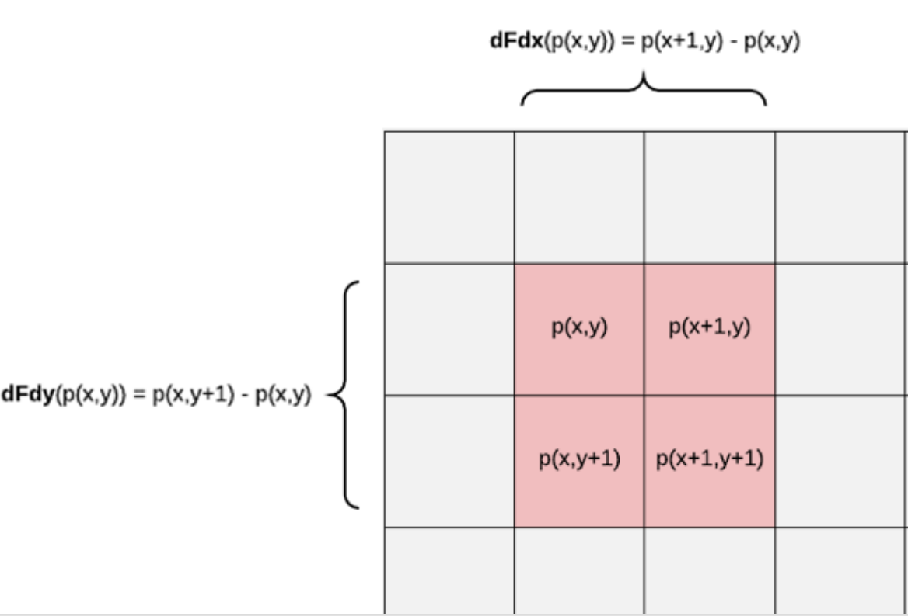

在三角形栅格化期间，GPU会同时跑片元着色器的多个实例，但并不是一个pixel一个pixel去执行的，而是将其组织在2x2的一组pixels块中并行执行。偏导数就是通过像素块中的变量的差值（变化率）而计算出来的。dFdx表示的是像素块中右边像素的值减去素块中左边像素的值，而dFdy表示的是下面像素的值减去上面像素的值。如下图所示，图中显示的是渲染的屏幕像素，图中红色区域是一个像素块，p(x,y)表示在屏幕空间坐标系中坐标（x，y）的片元（像素）上的某一个变量，图中显示了dFdx和dFdy的计算过程。
